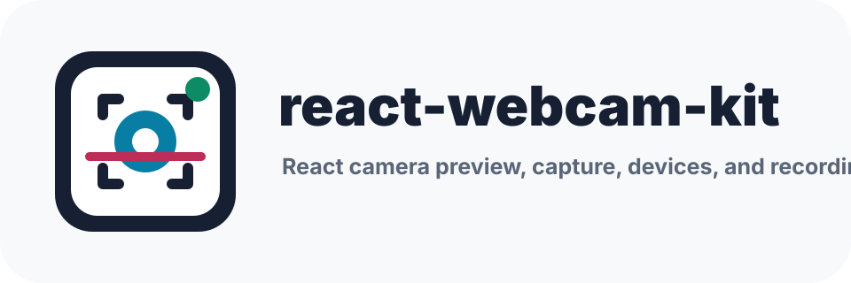

# react-webcam-kit

[](https://www.npmjs.com/package/react-webcam-kit)
[](https://www.npmjs.com/package/react-webcam-kit)
[](https://github.com/modeitsch/react-webcam-kit/actions/workflows/ci.yml)
[](https://bundlephobia.com/package/react-webcam-kit)
[](https://www.typescriptlang.org/)
[](./LICENSE)



A modern React webcam toolkit for camera preview, screenshot capture, video recording, device
switching, front/back mobile camera flows, and safe `getUserMedia` cleanup.

`react-webcam-kit` gives React apps a small, typed API over browser camera behavior. Use the
component when you want a ready webcam preview, or the hooks and utilities when you need custom
React camera capture, MediaRecorder, avatar upload, or mobile camera switching flows.

## Highlights

- `<Webcam />` preview component with imperative capture methods
- `useWebcam()` hook for stream lifecycle, permission state, and device switching
- `useCameraPermissions()` hook for preflight permission UI
- `useDevices()` hook for camera and microphone enumeration, maps, and counts
- `useAudioRecorder()` hook for microphone-only recording
- `useDisplayMedia()` hook for screen, window, and tab capture
- `useMediaRecorder()` hook for typed video recording, duration, max-duration, and Blob output
- `useObjectUrl()` hook for safe Blob previews
- `downloadBlob()` helper for recording and screenshot downloads
- `formatDuration()` helper for recorder timers
- `blobToFile()` and `createUploadFormData()` helpers for upload-ready camera files
- Recorder quality presets for low, medium, high, HD, and full-HD capture
- Recorder `cancel()`, `fileName`, `fileType`, and File output for retry/save flows
- Recorder and playback MIME support helpers
- Data URL, Blob, canvas, and ImageData capture utilities
- Exact `deviceId`, front/back `facingMode` switching, and advanced track constraints
- Predictable stream cleanup on stop, restart, switch, disable, and unmount
- Typed media errors for permission, device, security, and browser support states
- ESM, CommonJS, and TypeScript declaration output
- No required runtime dependency beyond React

## Install

```bash
npm install react-webcam-kit
```

```bash
pnpm add react-webcam-kit
```

```bash
yarn add react-webcam-kit
```

## Quick Start

```tsx
import { Webcam } from 'react-webcam-kit';

export function CameraPreview() {
  return (
    <Webcam
      audio={false}
      mirrored
      videoConstraints={{
        width: { ideal: 1280 },
        height: { ideal: 720 },
        facingMode: { ideal: 'user' },
      }}
    />
  );
}
```

## Capture A Screenshot

```tsx
import { useRef } from 'react';
import { Webcam, type WebcamHandle } from 'react-webcam-kit';

export function AvatarCapture() {
  const webcamRef = useRef<WebcamHandle>(null);

  return (
    <>
      <Webcam ref={webcamRef} audio={false} screenshotFormat="image/jpeg" />
      <button
        type="button"
        onClick={() => {
          const image = webcamRef.current?.getScreenshot({
            width: 512,
            height: 512,
            quality: 0.9,
          });
          console.log(image);
        }}
      >
        Capture
      </button>
    </>
  );
}
```

## Capture A Blob

```tsx
const blob = await webcamRef.current?.getScreenshotBlob({
  format: 'image/png',
});

if (blob) {
  const file = new File([blob], 'avatar.png', { type: blob.type });
  console.log(file);
}
```

## Record Video

```tsx
import {
  createUploadFormData,
  downloadBlob,
  formatDuration,
  getRecordingPresetConstraints,
  useAudioRecorder,
  useDisplayMedia,
  useMediaRecorder,
  useObjectUrl,
  useWebcam,
} from 'react-webcam-kit';

export function CameraRecorder() {
  const camera = useWebcam({
    audio: true,
    videoConstraints: getRecordingPresetConstraints('hd'),
  });
  const recorder = useMediaRecorder({
    fileName: 'camera-recording',
    fileType: 'webm',
    maxDuration: 30_000,
    quality: 'hd',
    stream: camera.stream,
  });
  const playbackUrl = useObjectUrl(recorder.blob);

  return (
    <>
      <video ref={camera.videoRef} autoPlay playsInline muted />
      <button type="button" onClick={() => recorder.start()}>
        Record
      </button>
      <button type="button" onClick={recorder.stop}>
        Stop
      </button>
      <button
        type="button"
        disabled={!recorder.file}
        onClick={() => {
          if (recorder.file) {
            downloadBlob(recorder.file);
          }
        }}
      >
        Download
      </button>
      {playbackUrl ? <video src={playbackUrl} controls /> : null}
      <p>{formatDuration(recorder.duration)}</p>
    </>
  );
}
```

Use `videoBitsPerSecond`, `audioBitsPerSecond`, `bitsPerSecond`, `mimeType`, and `timeslice` to tune
output size and browser behavior.

Use `quality: 'low' | 'medium' | 'high' | 'hd' | 'full-hd'` for a preset bitrate target, and pair it
with `getRecordingPresetConstraints()` when you want matching camera constraints.

Use `maxDuration`, `duration`, `recordingTimeLimitReached`, and `onMaxDuration` for recording time
limits and timer UI.

Use `cancel()` when the user wants to discard a recording and retry without creating a final Blob.

Use `muteAudio()` and `unmuteAudio()` to toggle microphone tracks during recording without changing
the preview element.

## Record The Screen

```tsx
import { useDisplayMedia, useMediaRecorder, useObjectUrl } from 'react-webcam-kit';

export function ScreenRecorder() {
  const screen = useDisplayMedia({
    audio: true,
    video: true,
  });
  const recorder = useMediaRecorder({
    fileName: 'screen-recording',
    fileType: 'webm',
    quality: 'hd',
    stream: screen.stream,
  });
  const playbackUrl = useObjectUrl(recorder.blob);

  return (
    <>
      <button type="button" onClick={() => void screen.start()}>
        Share screen
      </button>
      <button type="button" disabled={!screen.stream} onClick={() => recorder.start()}>
        Record
      </button>
      <button type="button" onClick={recorder.stop}>
        Stop recording
      </button>
      {playbackUrl ? <video src={playbackUrl} controls /> : null}
    </>
  );
}
```

`useDisplayMedia()` returns `status`, `stream`, `error`, `isSupported`, `start()`, and `stop()`. It
also reacts when the user stops sharing from the browser UI.

## Upload A Screenshot Or Recording

```tsx
import { createUploadFormData } from 'react-webcam-kit';

const form = createUploadFormData(recorder.file ?? recorder.blob!, {
  fieldName: 'video',
  fileName: 'intro.webm',
  fields: {
    userId,
  },
});

await fetch('/api/upload', {
  method: 'POST',
  body: form,
});
```

Use the same helper with screenshot Blobs from `getScreenshotBlob()`.

## Audio-Only Recording

Use `useAudioRecorder()` when you want the hook to request the microphone and start recording.

```tsx
import { useAudioRecorder, useObjectUrl } from 'react-webcam-kit';

export function VoiceNoteRecorder() {
  const recorder = useAudioRecorder({
    fileName: 'voice-note',
    fileType: 'webm',
    quality: 'medium',
  });
  const playbackUrl = useObjectUrl(recorder.blob);

  return (
    <>
      <button type="button" onClick={() => void recorder.start()}>
        Record voice note
      </button>
      <button type="button" onClick={recorder.stop}>
        Stop
      </button>
      {playbackUrl ? <audio src={playbackUrl} controls /> : null}
    </>
  );
}
```

`useAudioRecorder()` returns the recorder state plus `mediaStatus`, `mediaError`, `stream`, and
`stopStream()` for microphone lifecycle control.

## Build A Custom UI With `useWebcam`

```tsx
import { useWebcam } from 'react-webcam-kit';

export function CameraControls() {
  const camera = useWebcam({
    audio: false,
    onError(error) {
      console.error(error.type, error.message);
    },
  });

  return (
    <>
      <video ref={camera.videoRef} autoPlay playsInline muted />

      <button type="button" onClick={() => void camera.start()}>
        Start
      </button>
      <button type="button" onClick={camera.stop}>
        Stop
      </button>
      <button
        type="button"
        onClick={() => {
          const image = camera.getScreenshot();
          console.log(image);
        }}
      >
        Capture
      </button>

      <p>Status: {camera.status}</p>
    </>
  );
}
```

## Check Camera Permission

```tsx
import { useCameraPermissions } from 'react-webcam-kit';

export function PermissionPrompt() {
  const cameraPermission = useCameraPermissions();

  return (
    <button
      type="button"
      disabled={!cameraPermission.canRequest}
      onClick={() => void cameraPermission.requestPermission()}
    >
      {cameraPermission.permission === 'granted' ? 'Camera ready' : 'Enable camera'}
    </button>
  );
}
```

## Switch Cameras

Use `useDevices()` to list devices, then pass a video input device ID to `switchDevice()`.

```tsx
import { useDevices, useWebcam } from 'react-webcam-kit';

export function DevicePicker() {
  const devices = useDevices();
  const camera = useWebcam({ audio: false });

  return (
    <select
      value={camera.selectedDeviceId ?? ''}
      onChange={(event) => {
        void camera.switchDevice(event.target.value);
      }}
    >
      <option value="" disabled>
        Select a camera
      </option>
      {devices.videoInputs.map((device) => (
        <option key={device.deviceId} value={device.deviceId}>
          {device.label || 'Camera'}
        </option>
      ))}
    </select>
  );
}
```

`switchDevice()` uses an exact `deviceId` constraint:

```ts
{
  video: {
    deviceId: { exact: deviceId },
  },
}
```

For front/back mobile camera flows, use `switchFacingMode()`:

```tsx
await camera.switchFacingMode('environment');
await camera.switchFacingMode('user');
```

## Advanced Camera Controls

Browsers expose hardware-specific controls through `MediaStreamTrack.applyConstraints()`. Use
`applyVideoConstraints()` for capabilities such as torch, zoom, focus distance, or exposure when the
device supports them.

```tsx
const [track] = camera.stream?.getVideoTracks() ?? [];
const capabilities = track?.getCapabilities?.();

if (capabilities && 'torch' in capabilities) {
  await camera.applyVideoConstraints({
    advanced: [{ torch: true } as MediaTrackConstraintSet],
  });
}
```

## Browser Requirements

Camera access requires `navigator.mediaDevices.getUserMedia`. Browsers only expose it in secure
contexts such as HTTPS and localhost.

Mobile devices are sensitive to strict constraints. Prefer `ideal` values for width, height, and
`facingMode` unless your app can gracefully handle `overconstrained` errors.

```tsx
<Webcam
  audio={false}
  videoConstraints={{
    width: { ideal: 1280 },
    height: { ideal: 720 },
    facingMode: { ideal: 'environment' },
  }}
/>
```

Privacy-focused browsers and extensions may block canvas reads after drawing video frames. In that
case screenshot methods return `null`; show a fallback instead of assuming capture always succeeds.

## API Summary

### `<Webcam />`

| Prop                                         | Type                              | Purpose                                                     |
| -------------------------------------------- | --------------------------------- | ----------------------------------------------------------- |
| `audio`                                      | `boolean`                         | Request microphone tracks when `true`. Defaults to `false`. |
| `audioConstraints`                           | `MediaStreamConstraints['audio']` | Custom audio constraints.                                   |
| `videoConstraints`                           | `MediaStreamConstraints['video']` | Custom video constraints.                                   |
| `enabled`                                    | `boolean`                         | Start or stop the stream declaratively.                     |
| `startOnMount`                               | `boolean`                         | Start automatically on mount. Defaults to `true`.           |
| `mirrored`                                   | `boolean`                         | Mirror the preview and captured frames.                     |
| `muted`                                      | native video prop                 | Mute the preview element without changing stream audio.     |
| `screenshotFormat`                           | `ScreenshotFormat`                | Default screenshot output format.                           |
| `screenshotQuality`                          | `number`                          | Default screenshot quality for JPEG/WebP.                   |
| `forceScreenshotSourceSize`                  | `boolean`                         | Capture from the video source dimensions.                   |
| `imageSmoothing`                             | `boolean`                         | Enable or disable canvas image smoothing.                   |
| `minScreenshotWidth` / `minScreenshotHeight` | `number`                          | Minimum captured frame size.                                |
| `fallback`                                   | `ReactNode` or render function    | Rendered for unsupported, denied, or error states.          |
| `onStart` / `onStop`                         | callbacks                         | Stream lifecycle events.                                    |
| `onUserMedia` / `onUserMediaError`           | callbacks                         | Media request events.                                       |
| `onError`                                    | callback                          | Normalized media error event.                               |
| `onPermissionChange`                         | callback                          | Permission state updates.                                   |
| `onDevicesChanged`                           | callback                          | Device list updates.                                        |

The component also accepts ordinary `<video>` props such as `className`, `style`, `poster`, `muted`,
and `disablePictureInPicture`.

### `WebcamHandle`

| Method                                 | Purpose                                       |
| -------------------------------------- | --------------------------------------------- |
| `start()`                              | Request a stream.                             |
| `stop()`                               | Stop tracks and clear the video element.      |
| `switchDevice(deviceId, constraints?)` | Restart with an exact camera device ID.       |
| `switchFacingMode(mode, constraints?)` | Restart with an ideal front/back camera mode. |
| `applyVideoConstraints(constraints)`   | Apply constraints to the active video track.  |
| `getScreenshot(options?)`              | Return a Data URL or `null`.                  |
| `getScreenshotBlob(options?)`          | Return a `Blob` or `null`.                    |
| `getCanvas(options?)`                  | Return a canvas or `null`.                    |
| `stream`                               | Current `MediaStream`, if active.             |
| `video`                                | Current `HTMLVideoElement`, if mounted.       |

### `useWebcam()`

### `useMediaRecorder()`

`useMediaRecorder(options)` records an active `MediaStream` and returns recording state, chunks, the
final Blob, duration, max-duration state, and controls for `start`, `stop`, `pause`, `resume`, and
`reset`.

```tsx
const recorder = useMediaRecorder({
  stream: camera.stream,
  mimeType: 'video/webm',
  maxDuration: 30_000,
  quality: 'hd',
  videoBitsPerSecond: 1_500_000,
  timeslice: 1000,
});
```

### Recording quality helpers

`RECORDING_QUALITY_PRESETS` exposes the built-in bitrate and camera-size targets.
`getRecordingPresetConstraints('hd')` returns matching ideal video constraints for `useWebcam()` or
`<Webcam />`.

### `getSupportedMimeType()`

`getSupportedMimeType(candidates?)` returns the first MIME type supported by the current browser, or
`null` when `MediaRecorder` is unavailable.

`useWebcam(options)` returns stream state, a `videoRef`, capture methods, device controls, permission
state, and normalized errors.

### `useDevices()`

`useDevices()` returns `videoInputs`, `audioInputs`, `devicesById`, `devicesByType`, `counts`,
`permission`, `error`, and `refresh()`.

### `useCameraPermissions()`

`useCameraPermissions(options)` returns `permission`, `isSupported`, `canRequest`, `error`,
`refresh()`, and `requestPermission()`. `requestPermission()` probes the camera permission, stops the
temporary stream, and resolves to `true` when permission was granted.

### `useAudioRecorder()`

`useAudioRecorder(options)` requests a microphone stream, starts `useMediaRecorder()` with that
stream, and stops microphone tracks when recording stops.

### `useDisplayMedia()`

`useDisplayMedia(options)` requests browser screen, window, or tab capture with
`navigator.mediaDevices.getDisplayMedia()`. Pass the returned `stream` to `useMediaRecorder()` to
build a React screen recorder.

### `formatDuration()`

`formatDuration(duration)` formats milliseconds as `m:ss` for recorder timer UI.

### `blobToFile()` and `createUploadFormData()`

Use `blobToFile(blob, fileName)` to turn a screenshot or recording Blob into a named File. Use
`createUploadFormData(blobOrFile, options)` to build a `FormData` payload for upload endpoints.

### `captureFrame()`

`captureFrame(video, options)` captures from a ready `HTMLVideoElement` and can return a Data URL,
Blob, canvas, or ImageData.

## More Documentation

- [AI Usage Guide](./docs/AI-USAGE.md)
- [LLM Context](./llms.txt)
- [Full LLM Context](./llms-full.txt)
- [React Webcam Capture](https://modeitsch.com/react-webcam-kit/react-webcam-capture/)
- [React Camera Recording](https://modeitsch.com/react-webcam-kit/react-camera-recording/)
- [React Audio Recorder](https://modeitsch.com/react-webcam-kit/react-audio-recorder/)
- [React Screen Recorder](https://modeitsch.com/react-webcam-kit/react-screen-recorder/)
- [React QR Barcode Scanner](https://modeitsch.com/react-webcam-kit/react-qr-barcode-scanner/)
- [React Front/Back Camera](https://modeitsch.com/react-webcam-kit/react-front-back-camera/)
- [React Avatar Capture](https://modeitsch.com/react-webcam-kit/react-avatar-capture/)
- [React getUserMedia Hooks](https://modeitsch.com/react-webcam-kit/react-getusermedia-hooks/)
- [React QR Barcode Scanner Guide](./docs/REACT-QR-BARCODE-SCANNER.md)
- [React Screen Recorder Guide](./docs/REACT-SCREEN-RECORDER.md)
- [React Audio Recorder Guide](./docs/REACT-AUDIO-RECORDER.md)
- [API Reference](./docs/API.md)
- [Recipes](./docs/RECIPES.md)
- [Browser Notes](./docs/BROWSER-NOTES.md)
- [Migration Guide](./docs/MIGRATION.md)
- [Release Guide](./docs/RELEASE.md)
- [Comparison Notes](./docs/COMPARISON.md)
- [Browser Compatibility Matrix](./docs/COMPATIBILITY.md)
- [Security Policy](./SECURITY.md)
- [Code of Conduct](./CODE_OF_CONDUCT.md)

## Examples

- [Camera recorder starter](./examples/camera-recorder)
- [Vite starter](./examples/vite-starter)
- [Next.js App Router starter](./examples/next-app-router)
- [React Router starter](./examples/react-router)
- [Basic Vite example](./examples/basic)
- [Avatar capture](./examples/avatar-capture)
- [Video recorder](./examples/vite-recorder)
- [Mobile back camera](./examples/mobile-back-camera)
- [Video upload](./examples/video-upload)

## Development

```bash
npm install
npm run verify
```

Available scripts:

- `npm run build` - build ESM, CommonJS, and type declarations
- `npm run typecheck` - run TypeScript without emitting files
- `npm run lint` - run ESLint with zero warnings
- `npm run format:check` - verify Prettier formatting
- `npm run test` - run Vitest
- `npm run audit` - check production and development dependencies for high severity advisories
- `npm run size` - enforce the published bundle-size budget
- `npm run verify` - run the full release gate

## Publishing

Release from a version tag:

```bash
git tag v0.7.2
git push origin master --tags
```

The publish workflow verifies the package, publishes to npm with provenance, and creates the GitHub
release. Configure npm trusted publishing for `.github/workflows/publish.yml` before using the tag
flow:

- Publisher: GitHub Actions
- Repository owner: `modeitsch`
- Repository name: `react-webcam-kit`
- Workflow file: `publish.yml`
- Environment: leave empty unless you add one to the workflow

See the [Release Guide](./docs/RELEASE.md) for the full checklist.

Before local dry-runs:

```bash
npm run verify
npm pack --dry-run
npm publish --dry-run
```

## License

MIT
